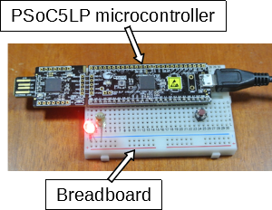
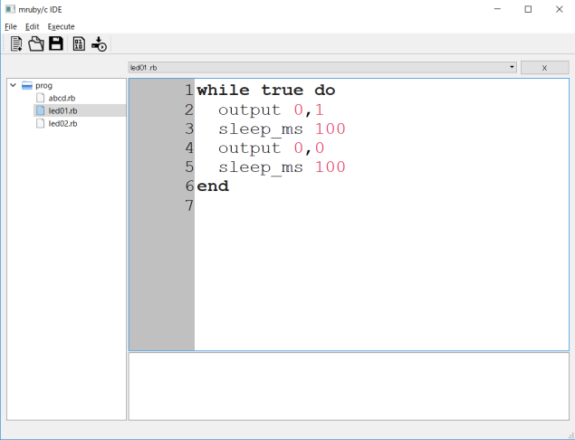
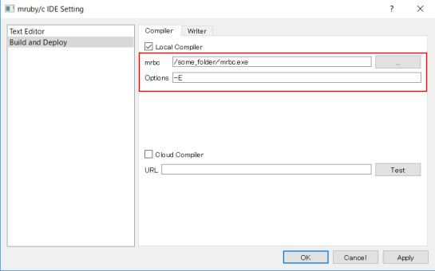
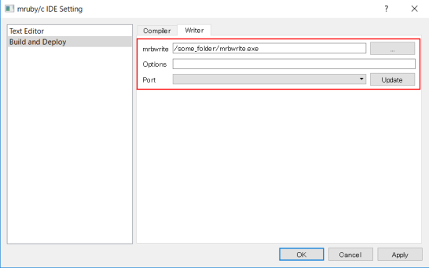
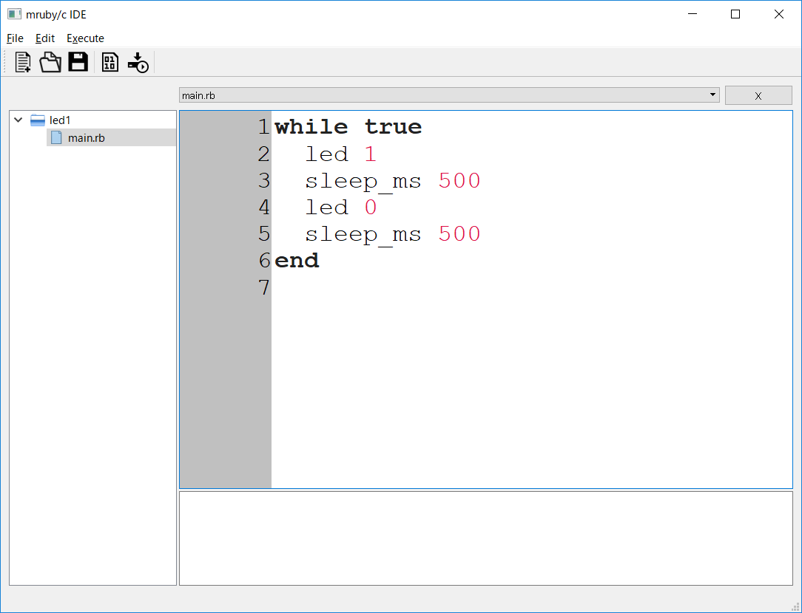

# mruby/c programming environment

This environment provides mruby/c programming editor, compiler, and writer for microcontroller. We can implement device controlling software and execute on the board.

- If you have mruby/c ready microcontroler, go to **Software**.
- If you have PSoC5LP microcontroler without mruby/c VM, go to **Firmware**.
- Otherwise, go to **Hardware**.

## Hardware



- Cypress PSoC5LP microcontroller

The microcontoroller [CY8CKIT-059 PSoC 5LP Prototyping Kit](http://www.cypress.com/documentation/development-kitsboards/cy8ckit-059-psoc-5lp-prototyping-kit-onboard-programmer-and) is used in this environment.

- Breadboard

Any breadboard is available. For example, [Breadboard](https://www.chip1stop.com/product/detail?partId=SEED-0000290&mpn=319030001) is okay.

- USB cable

USB-microB cable is used for connecting to PC.

## Firmware

An appropriate firmware should be installed PSoC5LP microcontroller before mruby/c programming.

## Software



Mruby/c IDE(Integrated Development Environment) provides total programming environment such as editor, compiler and downloader. Developers write mruby code in IDE editor and compile mruby code into mruby bytecode which is executed in mruby/c VM. The compiled bytecode is transferred to microcontroller by USB cable.

### IDE download

mruby/c ide is available from following URLs.

- [IDE for Windows 10](http://www.s-itoc.jp/usr/ide/windows/mrubyc_ide1.02_win.zip)
- [IDE for MacOS](http://www.s-itoc.jp/usr/ide/windows/mrubyc_ide1.02_win.zip)

### IDE setup

Firstly, connect microcontroller and PC by USB cable. 

Select [File]-[Settings...] menu, and choose "Build and Deploy" item in listbox. 

In "Compiler" tab, set "mrbc" and "Options" boxes. These configurations affect to mruby/c compilation.

- "mrbc" : select mrbc executable file such as mrbc.exe(Windows) or mrbc(MacOS).
- "Options" : Input "-E".



In "Writer" tab, set "mrbwrite" and "Port" boxes. These configurations affect to mruby/c bytecode transferring. 

- "mrbwrite" : select mrbc executable file such as mrbwrite.exe(Windows) or mrbwrite(MacOS).
- "Port" : select one from listbox, usually its name contains "USB Serrial" or "tty" keyword.



## Programming

Mruby/c programming is completed by following steps.

1. Create new project\
One project has one or more mruby/c program files. All programs are executed simultaneously, which is called "concurrent execution.\
Select [File]-[New]-[Project] menu, you can create new project.

2. Create new mruby/c program\
When microcontroller is activated(turn on the power or reset), it starts all mruby/c programs.\
All filenames of mruby/c must be ended with ".rb".\
Select [File]-[New]-[File] menu, you can create new file.

3. Compile and transfer\
Selecting [Execute]-[Write] menu, IDE builds mruby/c project and transfer compiled bytecode into microcontroller.

### Blinking blue LED

Let's start mruby/c programming.

The first mruby/c program is blinking one LED.
Through coding and executing this simple application, we can learn about programming way of mruby/c.

Write the following program into IDE editor. About mruby/c methods such as "led" and "sleep_ms", refer to [Reference Manual](reference.md).

```ruby
while true
  led 1
  sleep_ms 500
  led 0
  sleep_ms 500
end  
```

 This image shows after creating "led1" project and "main.rb" file in mruby/c IDE.




### Blinking two LEDs

### Concurrent execution

